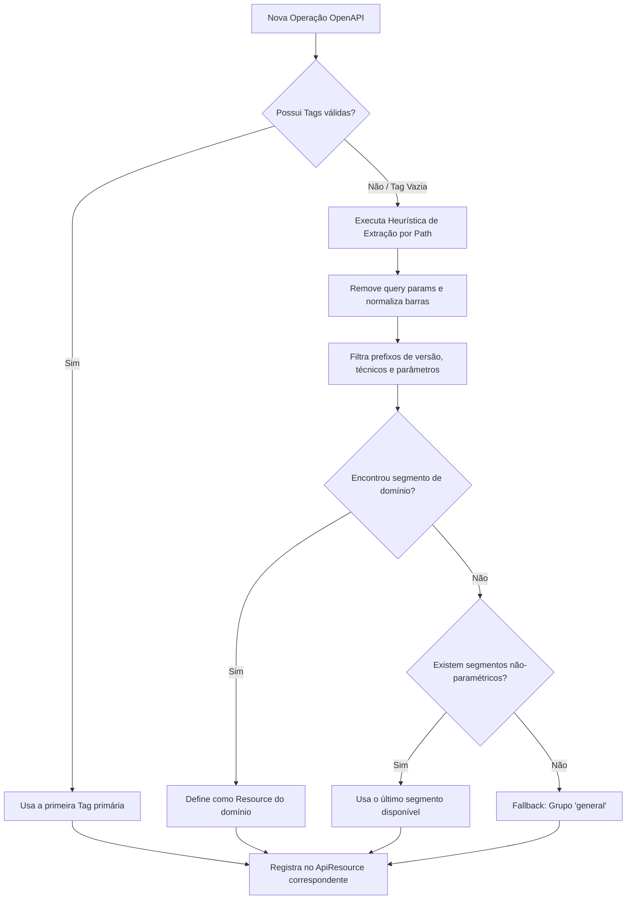

# Heurísticas de Descoberta e Organização de ApiResource

Este documento descreve a lógica e as heurísticas empregadas pelo ApiCanvas para descobrir, organizar e apresentar recursos de APIs (`ApiResource`) a partir de especificações OpenAPI 3.x e Swagger 2.0.

---

## 1. Visão Geral e Princípios Fundamentais

1. **Inclusão Total**: Nenhuma operação válida é descartada. Toda operação identificada pertence a um recurso navegável.
2. **Não-Duplicação**: Cada operação pertence a exatamente um recurso principal no menu de navegação lateral.
3. **Agnóstico à Estrutura da URL**: Não se assume que todas as APIs seguem rigidamente o padrão `/api/{resource}`.
4. **Preservação de Operações Especiais**: Ações e sub-recursos (ex.: `POST /orders/{id}/approve`, `POST /orders/{id}/cancel`, `GET /users/{id}/addresses`) são preservados sob o domínio de seu recurso pai (`orders`, `users`).
5. **Legibilidade vs. Precisão Técnica**: O nome técnico original (`name`) é preservado integralmente, enquanto um rótulo amigável (`label`) em Title Case é gerado para a interface do usuário.

---

## 2. Ordem de Precedência na Descoberta

---

## 3. Heurísticas de Extração de Recursos

### 3.1. Agrupamento por Tags (Prioritário)
- Se a operação declarar `tags`, a primeira tag não-vazia (`op.tags[0]`) é utilizada como chave do recurso.
- Se o documento OpenAPI contiver metadados na raiz (`doc['tags']`), descrições associadas (`description`) são mapeadas automaticamente para o `ApiResource`.
- Tags adicionais na mesma operação não geram duplicatas na barra lateral, preservando a clareza e evitando poluição visual.

### 3.2. Fallback por Análise de Caminho (Path-Based Fallback)
Quando tags não são fornecidas ou contêm apenas espaços em branco, a rota é analisada de acordo com as seguintes regras:

1. **Limpeza**: Descarte de query parameters (`?key=val`), âncoras (`#anchor`) e normalização de barras duplas/iniciais.
2. **Descarte de Prefixos Técnicos e de Versão**:
   - Prefixos de versão: Expressões regulares capturando `v1`, `v2.0`, `v3.1`, `v1beta1`, `v2alpha`, `api-v1`, etc.
   - Prefixos técnicos comuns: `api`, `rest`, `service`, `services`, `app`, `public`, `private`, `internal`, `external`, `ws`.
3. **Salto de Parâmetros Iniciais**:
   - Segmentos entre chaves que antecedem o recurso (ex.: `/{tenantId}/customers`, `/{orgId}/v2/{lang}/products`) são ignorados para localizar o verdadeiro nome do recurso (`customers`, `products`).
4. **Resolução do Domínio Raiz**:
   - O primeiro segmento semântico após os filtros é considerado o recurso pai.
   - Sub-rotas como `/orders/{id}/approve` ou `/orders/{id}/items` resultam no recurso `orders`.
5. **Fallback Seguro**:
   - Rotas raiz `/` ou puramente parametrizadas `/{id}` recebem o recurso padrão `general`.
   - Rotas estáticas pontuais (`/health`, `/metrics`, `/ping`) formam seus próprios recursos.

---

## 4. Transformação de Identificadores e Rótulos

| Entrada Original | Identificador (`id`) | Nome Técnico (`name`) | Rótulo Amigável (`label`) |
| :--- | :--- | :--- | :--- |
| `order-items` | `order-items` | `order-items` | `Order Items` |
| `user_profiles` | `user-profiles` | `user_profiles` | `User Profiles` |
| `OrderManagement` | `ordermanagement` | `OrderManagement` | `Order Management` |
| `api_v2_orders` | `api-v2-orders` | `api_v2_orders` | `Api V2 Orders` |
| `health` | `health` | `health` | `Health` |
| `""` ou `"/"` | `general` | `general` | `General` |

---

## 5. Desacoplamento da Classificação CRUD

A descoberta e agrupamento de recursos (`ApiResource`) é responsável unicamente pela estrutura de navegação e taxonomia. A classificação operacional (List, Details, Create, Update, Delete, Action) é executada de forma independente pelo `OperationClassifierService`, garantindo separação de responsabilidades.
