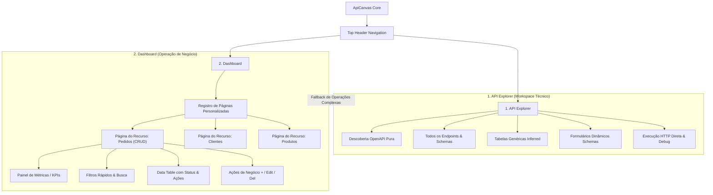
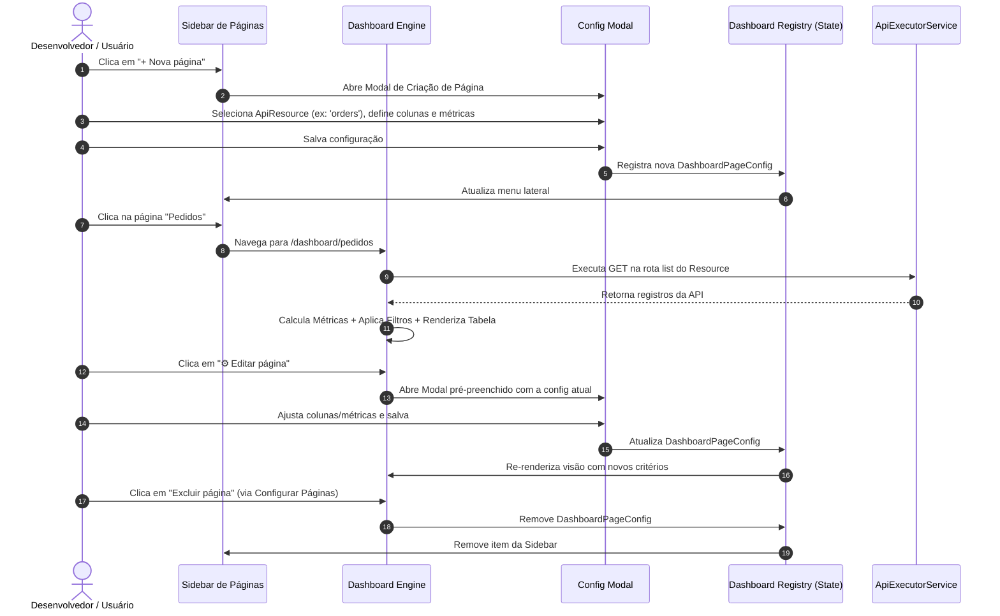
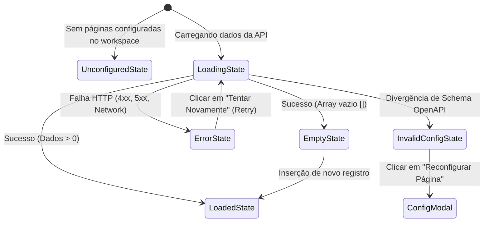

# Especificação Funcional e Técnica — Módulo Dashboard & API Explorer

> **Referência Visual Principal**: [`docs/prototypes/dashboard-pedidos-crud.png`](file:///e:/projetos/api-canvas/docs/prototypes/dashboard-pedidos-crud.png)  
> **Diretriz de Design**: [`VISUAL_IDENTITY.md`](file:///e:/projetos/api-canvas/VISUAL_IDENTITY.md) (Technical Dark UI)  
> **Status**: Formalizado / Aprovado para Planejamento de Implementação

---

## 1. Visão Geral e Arquitetura de Áreas do Produto

O **ApiCanvas** evolui de um visualizador Swagger/OpenAPI reativo para uma plataforma de engenharia de APIs dividida em **duas áreas complementares e integradas**:



### 1.1. `API Explorer` (Workspace Técnico Atual)
- **Propósito**: Ferramenta técnica para desenvolvedores e QA explorarem 100% da superfície da API sem restrições.
- **Comportamento**:
  - Geração automática e instantânea a partir do OpenAPI JSON.
  - Exibe todos os recursos (`ApiResource`) e operações (`list`, `details`, `create`, `update`, `delete`, `custom`).
  - Permite inspecionar schemas JSON brutos, headers HTTP, status codes e payloads arbitrários.
  - Sempre disponível como referência de baixo nível e fallback operacional.

### 1.2. `Dashboard` (Páginas Operacionais Personalizadas)
- **Propósito**: Interface orientada a dados e fluxos de negócio para visualização executiva e operações rotineiras sobre recursos selecionados.
- **Comportamento**:
  - Organizado por **Páginas Personalizadas** (ex.: *Pedidos*, *Clientes*, *Faturas*).
  - Cada página se acopla a um `ApiResource` específico da API conectada.
  - Oferece visão consolidada: **Cards de Métricas (KPIs)**, **Filtros e Busca de Domínio**, **Tabela Customizada com Status Semânticos** e **Ações Primárias/Contextuais**.

---

## 2. Referência Visual do Protótipo

A interface oficial do Dashboard segue rigorosamente o layout e a densidade estabelecidos no protótipo aprovado:


### Decomposição Visual por Zonas:

| Zona | Elemento no Protótipo | Papel Funcional |
| :--- | :--- | :--- |
| **Top Navigation** | `Connect`, `API Explorer`, `+ Dashboard` (Active Tab) | Alternância de modo de produto mantendo a sessão e conexão ativas. |
| **Context Bar** | `OrderFlow.Orders.Api v1.0`, `BASE URL`, `Connected`, `Auth`, `Change API` | Metadados da API OpenAPI conectada e controles de autenticação globais. |
| **Sidebar** | `PÁGINAS`, `+ Nova página`, Links de Páginas com Badges, `⚙ Configurar páginas` | Lista de páginas customizadas criadas para o workspace atual. |
| **Page Header** | Título (`Pedidos`), Descrição, `⚙ Editar página`, `🔄 Refresh`, `+ Adicionar pedido` | Identificação da visão atual, recarregamento e ação primária de inserção. |
| **KPI Metrics** | 4 Cards: `Total (128)`, `Pendentes (18)`, `Em processamento (7)`, `Concluídos hoje (24)` | Resumo numérico operacional com cores semânticas (`warning`, `info`, `success`). |
| **Filter Bar** | Input de Busca, Select de Status, Filtro de Data, Contador de registros (`128`) | Controles de filtragem síncrona/reativa sobre os dados da listagem. |
| **Data Table** | Colunas personalizadas, Badges de Status estilizados, Monospace IDs, Coluna de Ações | Visualização estruturada com ações por linha (`View`, `Edit`, `Transition`, `Delete`). |
| **Pagination** | `1-10 de 128`, `10 por página ⌃`, Controles numéricos de página | Navegação e dimensionamento do volume de registros por página. |

---

## 3. Modelo Estrutural da Página Personalizada

Cada página do Dashboard é declarada através de um contrato de configuração (`DashboardPageConfig`):

```typescript
export interface DashboardPageConfig {
  id: string;                      // Identificador único (ex: 'orders-page')
  resourceId: string;              // Id do ApiResource vinculado (ex: 'orders')
  slug: string;                    // Rota de navegação (ex: 'pedidos')
  title: string;                   // Título exibido (ex: 'Pedidos')
  description?: string;            // Descrição da página
  icon?: string;                   // Ícone representativo (ex: 'receipt_long')
  
  // 1. Métricas / KPIs de Topo
  metrics: DashboardMetricConfig[];

  // 2. Filtros & Busca
  filters: {
    searchFields: string[];        // Campos avaliados na busca global (ex: ['id', 'clientName', 'email'])
    searchPlaceholder?: string;    // Placeholder customizado
    statusField?: string;          // Campo de status para o dropdown rápido (ex: 'status')
    dateField?: string;            // Campo de data para filtro temporal (ex: 'createdAt')
  };

  // 3. Tabela & Colunas
  table: {
    columns: DashboardColumnConfig[];
    defaultSortField?: string;
    defaultSortOrder?: 'asc' | 'desc';
    pageSize: number;              // Padrão: 10
    pageSizeOptions: number[];     // Ex: [10, 25, 50, 100]
  };

  // 4. Ações de Página e Linha
  actions: {
    primaryCreateActionId?: string; // ID da operação de criação (POST)
    primaryCreateLabel?: string;    // Ex: '+ Adicionar pedido'
    rowActions: {
      viewDetails: boolean;         // Habilita Drawer lateral de detalhes
      edit: boolean;                // Habilita Dialog de edição (PUT/PATCH)
      delete: boolean;              // Habilita Dialog de confirmação de exclusão (DELETE)
      customActionOperations?: string[]; // IDs de operações adicionais (ex: 'cancelOrder')
    };
  };
}

export interface DashboardMetricConfig {
  id?: string;
  label: string;
  icon?: string;
  type?: 'count_all' | 'count_matching' | 'sum_field' | string;
  field?: string;
  matchingValue?: unknown;
  colorScheme?: 'default' | 'primary' | 'warning' | 'info' | 'success' | 'danger';
  format?: 'number' | 'currency' | 'percent' | string;
  description?: string;
}

### 3.1. Diretrizes Arquiteturais do Avaliador de Métricas (`UiMetricEvaluatorService`):
1. **Genericidade**: Nenhuma regra de negócio fixa (ex.: 'status', 'pedidos') embutida no core do componente ou serviço. O cálculo é derivado exclusivamente do descriptor.
2. **Ocultamento Automático**: Se nenhuma métrica for configurada (`metrics` ausente ou array vazio), a faixa de métricas é 100% omitida do DOM, sem gaps ou espaços vazios.
3. **Controle de Densidade**: Exibição limitada a no máximo 6 métricas (idealmente 2 a 4 conforme o protótipo), preservando a clareza e caráter de ferramenta profissional.
4. **Cálculo Local vs. Paginação Server-side**: Métricas locais (`count_matching`, `sum_field`) avaliam o conjunto de dados em memória carregado na página ativa. A métrica `count_all` utiliza prioritariamente o `totalCount` retornado pelo backend.
5. **Cores Semânticas Restritas**: Mapeamento exclusivo para tokens canônicos do sistema de design (`color-default`, `color-primary`, `color-warning`, `color-info`, `color-success`, `color-danger`).

export interface DashboardColumnConfig {
  field: string;
  label: string;
  type: 'text' | 'number' | 'currency' | 'date' | 'status_badge' | 'monospace';
  sortable: boolean;
  statusBadgeMap?: Record<string, { label: string; color: string; icon?: string }>;
}
```

---

## 4. Ciclo de Vida e Fluxos do Usuário



### 4.1. Fluxo 1: Criar Página
1. O usuário clica em `+ Nova página` na barra lateral ou no estado vazio.
2. O sistema lista os `ApiResource` identificados na especificação OpenAPI ativa.
3. O usuário seleciona o recurso desejado (ex.: `orders`).
4. O assistente de configuração infere automaticamente:
   - Título e slug a partir do nome do recurso.
   - Colunas sugeridas com base nas propriedades do schema retornado pelo endpoint `GET`.
   - Cards de métricas sugeridos (contagem total e distribuição dos valores de `status` se houver campo correspondente).
   - Operação de criação (`POST`) vinculada ao botão principal.
5. O usuário confirma ou personaliza os campos e salva. A página passa a constar na Sidebar.

### 4.2. Fluxo 2: Abrir Página Existente
1. Ao clicar no item da Sidebar (ou navegar via URL `/dashboard/:slug`), a página é ativada.
2. A aplicação dispara a requisição `GET` para a operação de listagem configurada.
3. Os dados recebidos alimentam os cards de métricas, as opções dos filtros e as linhas da tabela.
4. O contador de registros da Sidebar e do cabeçalho da tabela é atualizado.

### 4.3. Fluxo 3: Editar Página
1. O usuário clica no botão `⚙ Editar página` no cabeçalho superior direito.
2. O modal de edição permite reordenar/ocultar colunas, alterar regras de badge de status, adicionar novos cards de KPI e redefinir os campos de busca.
3. As alterações são persistidas no estado local/sessão do workspace e refletem imediatamente na tela.

### 4.4. Fluxo 4: Excluir Página
1. Através de `⚙ Configurar páginas` na base da sidebar ou pelo menu de opções da página, o usuário pode excluir a página customizada.
2. Um diálogo de confirmação é exibido alertando que **apenas a configuração visual do dashboard está sendo removida**, sem nenhum impacto na API ou nas rotas da OpenAPI.

---

## 5. Matriz de Estados de Interface (Obrigatórios)

Toda página de Dashboard deve tratar e apresentar visualmente os **5 estados obrigatórios**:



| Estado | Condição de Disparo | Apresentação Visual | Ações Disponíveis |
| :--- | :--- | :--- | :--- |
| **1. Carregamento (`Loading`)** | Requisição `GET` em andamento. | Skeleton loaders nos 4 cards de KPIs e nas linhas da tabela; botões de ação em estado desabilitado. | Nenhuma ação bloqueante. |
| **2. Erro (`Error`)** | Falha de rede, timeout, HTTP 401, 403, 404 ou 500. | Card sóbrio com borda de perigo (`--color-danger`), badge com status code HTTP retornado e mensagem técnica detalhada. | Botão `🔄 Tentar novamente` e link `Inspecionar no API Explorer`. |
| **3. Vazio (`Empty`)** | Endpoint responde `200 OK` com `[]` ou lista sem itens. | Painel centralizado com ícone do recurso, texto *"Nenhum registro encontrado"* e métricas zeradas (`0`). | Botão `+ Adicionar {Recurso}` (se houver operação `POST` configurada). |
| **4. Sem Configuração (`Unconfigured`)** | Primeira visita ao Dashboard ou recurso sem página customizada. | Tela de boas-vindas ao Dashboard com resumo dos recursos detectados pela OpenAPI e sugestão de templates CRUD. | Botão `+ Criar primeira página` e atalhos para gerar páginas automáticas por recurso. |
| **5. Configuração Inválida (`Invalid Config`)** | OpenAPI alterada (campos renomeados/removidos) ou JSON de config corrompido. | Alerta visual (`--color-warning`) indicando incompatibilidade entre os campos da tabela/KPIs e o schema atual da OpenAPI. | Botões `⚙ Reconfigurar mapeamento` e `Restaurar padrão`. |

---

## 6. Integração e Fallback com o API Explorer

O Dashboard não substitui a capacidade técnica do API Explorer; ele atua como uma camada superior de produtividade:

1. **Acesso Global Unificado**: O usuário pode alternar entre `API Explorer` e `Dashboard` a qualquer momento pelo topo da interface, sem perder autenticação, Base URL ou especificações carregadas.
2. **Botão de Fallback Contextual**: No cabeçalho de cada página do Dashboard e em cada diálogo de erro, existe o link/botão `"Abrir no API Explorer"`, que leva o usuário diretamente ao recurso técnico correspondente com todas as operações e schemas expostos.
3. **Operações Especiais Não-Representadas**: Quando um recurso OpenAPI possuir endpoints que fogem do padrão CRUD comum (ex.: upload binário multipart, webhooks, sub-rotas profundas com múltiplos parâmetros de rota), o Dashboard exibe um atalho direto para executar a operação no API Explorer.

---

## 7. Limites de Escopo do Incremento 1 vs. Fases Posteriores

### 7.1. Escopo do Primeiro Incremento (MVP do Dashboard)
- [x] Especificação técnica e formalização da arquitetura de duas áreas (`API Explorer` vs `Dashboard`).
- [x] Registro da referência visual canônica (`docs/prototypes/dashboard-pedidos-crud.png`).
- [ ] Implementação da navegação superior (`TopNav`) com chaveamento entre `API Explorer` e `Dashboard`.
- [ ] Sidebar do Dashboard com lista de páginas criadas, badges de contagem e botão `+ Nova página`.
- [ ] Mecanismo de persistência de configurações de páginas em memória/`LocalStorage`.
- [ ] Componente de página personalizada renderizando:
  - Header com título, descrição, botão de recarregar e botão de criação primário.
  - Grid de 4 Cards de Métricas (contagens baseadas no dataset retornado pelo GET).
  - Barra de filtro simples (busca textual por múltiplos campos e dropdown de filtro por status).
  - Tabela personalizada com colunas tipadas, formatação de moeda/data/código, badge de status estilizado e coluna de ações (`Visualizar`, `Editar`, `Excluir`).
- [ ] Implementação de todos os 5 estados obrigatórios (`Loading`, `Error`, `Empty`, `Unconfigured`, `Invalid Config`).
- [ ] Ações integradas com os serviços de execução já existentes (`ApiExecutorService`, dialogs de criação, edição e exclusão).

### 7.2. O que fica para Fases Posteriores (Backlog Futuro)
- **Persistência Remota / Multi-Workspace**: Sincronização de configurações de dashboard em nuvem ou export/import de templates `.json`.
- **Filtros Avançados e Datepicker Completo**: Construtor de queries complexas com múltiplos operadores (`AND`/`OR`) e calendário com seleção de intervalo.
- **Gráficos e Novos Tipos de Widgets**: Gráficos de barras, linhas, rosca e timelines de eventos acoplados aos dados da API.
- **Ações RPC Customizadas**: Mapeamento visual para disparar operações arbitrárias de rota (ex.: `POST /orders/{id}/approve`) diretamente de botões personalizados na tabela.
- **Paginação Server-side**: Tradução automática de parâmetros de paginação e ordenação para query params da OpenAPI (`page`, `pageSize`, `skip`, `take`, `sort`).

---

## 8. Conformidade com a Identidade Visual (`VISUAL_IDENTITY.md`)

O módulo Dashboard foi especificado e deve ser construído respeitando estritamente os princípios de **Developer Tool Madura**:

1. **Paleta de Cores e Superfícies**:
   - Fundo principal: `--canvas-bg: #0d1117`.
   - Superfície da sidebar e cards: `--canvas-surface: #161b22`.
   - Superfície elevada / cabeçalho: `--canvas-surface-elevated: #21262d`.
   - Bordas finas estruturais: `--canvas-border: #30363d` e `--canvas-border-subtle: #21262d`.
2. **Tipografia e Dados**:
   - Títulos e textos de controle: `--font-sans: Inter, sans-serif`.
   - IDs (`#1048`), rotas, datas e valores técnicos: `--font-mono: "JetBrains Mono", monospace`.
3. **Badges de Status**:
   - Pendente: Borda e texto em `--color-warning: #bb8009` com fundo sutil.
   - Em processamento: Borda e texto em `--color-info: #1f6feb` com fundo sutil.
   - Concluído: Borda e texto em `--color-success: #2ea043` com fundo sutil.
   - Cancelado: Borda e texto em `--color-danger: #da3633` com fundo sutil.
4. **Ausência de Ruído Visual**:
   - Proibido uso de gradientes brilhantes, neon, glassmorphism, blur decorativo ou sombras pesadas.
   - Densidade e alinhamento milimétrico com base de 4px / 8px.
